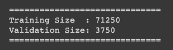
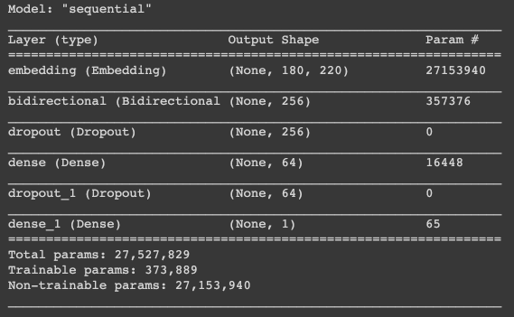
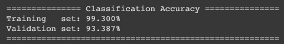
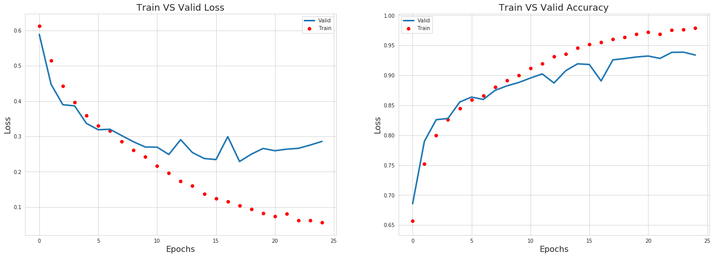
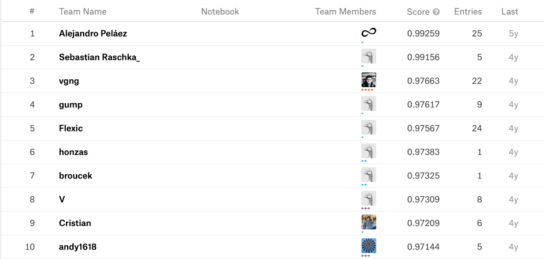
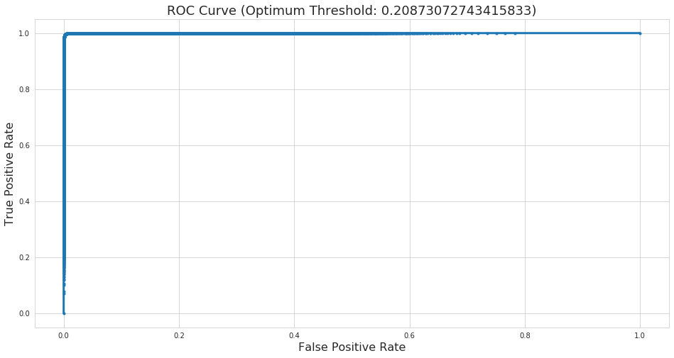
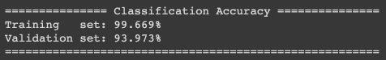

# Introduction
This is a  sentiment analysis project where the aim is to classify each review's sentiment by estimating the IMDB rating on each movie. 
To make it clearer, you were tasked to develop a model which can analyze each word in each review and determine if the review has positive or negative sentiment.
(Positive sentiment indicates the movie rating is >= 7, otherwise it will be a negative sentiment).

To achieve this aim, we can defined objectives as follow:
* **Data Wrangling:** Clean the text (e.g. remove html tags, symbols, etc.), text normalization (e.g., lemmatization), stop word removal, etc.
* **Word Embedding:** Convert each word to vector space.
* **Model Development:** Develop and train a deep learning model to classify each review's sentiment.
* **Optimization:** Check the model performance and determine the optimization needed to improve the classification accuracy.

# Data Wrangling
The dataset consist of 50,000 IMDB movie reviews, specially selected for sentiment analysis. 
The dataset was split into:
* labeledTrainData.tsv
* testData.tsv
* unlabeledTrainData.tsv (extra training set with no labels)

All three dataset have the following properties:
* The sentiment of reviews is binary, meaning the IMDB rating < 5 results in a sentiment score of 0, and rating >=7 have a sentiment score of 1. 
* For each movie, there contain multiple reviews with no more than 30 reviews in total.
* labeledTrain and testData contain 25,000 review each with labeled and unlabeled sentiments.

***(I managed to find another similar dataset from kaggle to help improve the model performance, you can download the additional dataset [here](https://www.kaggle.com/utathya/imdb-review-dataset))***

With that in mind, we can first assess the data quality to determine the level of data engineer required 
(e.g., data cleaning and preparation).
```bash
import re
import nltk
import sklearn
import numpy             as np
import pandas            as pd
import seaborn           as sns
import matplotlib.pyplot as plt

from pprint              import pprint
from bokeh.io            import output_notebook, show
from bokeh.models        import ColumnDataSource
from bokeh.palettes      import Spectral6
from bokeh.plotting      import figure
from lib.data_preprocess import Preprocess
from nltk.corpus         import stopwords 
from nltk.tokenize       import word_tokenize
from nltk.stem           import WordNetLemmatizer
from bs4                 import BeautifulSoup
from PIL                 import Image
from wordcloud           import WordCloud, STOPWORDS, ImageColorGenerator
from tqdm                import tqdm_notebook as tqdm
from scipy               import stats

# plot setting
output_notebook()
sns.set_style('whitegrid')
param = {'figure.figsize': (16, 8),
         'axes.titlesize': 18,
         'axes.labelsize': 16}
plt.rcParams.update(param)

# ntlk setting
nltk.download('stopwords')
nltk.download('wordnet')
nltk.download('punkt')

# %load_ext tensorboard

label_path   = 'gdrive/My Drive/dataset/IMDB/labeledTrainData.tsv'
unlabel_path = 'gdrive/My Drive/dataset/IMDB/unlabeledTrainData.tsv'
add_path     = 'gdrive/My Drive/dataset/IMDB/imdb_master.csv'
test_path    = 'gdrive/My Drive/dataset/IMDB/testData.tsv'

# read in the dataset
pp                = Preprocess()
unlabel_df        = pd.read_csv(unlabel_path, error_bad_lines=False, delimiter='\t')
add_df            = pd.read_csv(add_path, error_bad_lines=False, delimiter=',', encoding='latin_1')[['review', 'label']]
train_df, test_df = pp.read_file(label_path, test_path, sep='\t')

# rename the add_df's column name to match with IMDB dataset
add_df.columns      = ['review','sentiment']
add_df['sentiment'] = add_df['sentiment'].apply(lambda x: 0 if x == 'neg' else 1)

# record the twitter and train dataframe size
add_size   = add_df.shape[0]
label_size = train_df.shape[0]

# check for missing value
print('Train set:')
pp.check_na(train_df)
print()

print('Unlabel data set:')
pp.check_na(unlabel_df)
print()

print('Additional dataset:')
pp.check_na(add_df)
print()

print('Test set:')
pp.check_na(test_df)

``` 

#### Output:


The output above showed the dataset is complete which allows us to proceed to the next task. 

### Text Cleaning and Normalization 
If you check the *'review'* data in the dataset, you will notice that most of the reviews contain improper word such as html tags, excessive symbols, grammar mistake, etc.
While these improper wording might not effect a human's judgement on sentimental classification, it will definitely affect the deep learning model on the later step.


Thus, we need to clean and normalize the text to aid the model on understanding each words. 
We'll start by cleaning the text:
* converting all letters to lower case.
* remove excessive white spaces.
* remove non-words (e.g., punctuation and symbols).
* remove html tags.

```bash
# convert it to lower space
def text_process(df):
    # convert it to lower space
    df.review = df.review.str.lower()

    # pattern
    nw_removal  = lambda review: re.sub(r'[^A-Za-z\s]', ' ', review)
    spc_removal = lambda review: re.sub(r'[\s]+'      , ' ', review)
    tag_removal = lambda review: BeautifulSoup(review, 'lxml').get_text()

    # replace words or substrings which match the pattern
    df.review = df.review.apply(tag_removal)
    df.review = df.review.apply(nw_removal)
    df.review = df.review.apply(spc_removal)
    
    return df

# clean the review
train_df = text_process(train_df)
test_df  = text_process(test_df)

```

After we clean the reviews, the next thing we can do is to convert each word back to it's root.
This can greatly reduce the vocabulary size and help the model identify the root expression of each review.
The techniques that used to find the root are called:

* **Stemming:** “The process of reducing inflection of words to their root forms such as mapping a group of words into a word stem even if the steam is not a valid word in language. “ 
* **Lemmatization:** “The process of ensuring the root word belongs to the language”. For example, (run, ran, running) -> run.

For more details about the stemming and lemmatization techniques, please visit this [tutorial](https://www.datacamp.com/community/tutorials/stemming-lemmatization-python).
In short, the two techniques above are used for text mining (i.e., to extract high-quality information from text) applications.
The applications include **text categorization, text clustering, concept/entity extraction, production of granular taxonomies, sentiment analysis, document summarization, and entity relation modeling**.
 
In this project, we will use the lemmatization techniques to get the root word in proper english language.

```bash
def lemmatize(review):
    lemmatization = WordNetLemmatizer()
    stop_words    = set(stopwords.words('english'))
    
    # tokenize, lemmatize and stop words removal
    tokens            = word_tokenize(review)
    lemmatized_tokens = list(map(lambda x: lemmatization.lemmatize(x, pos='v'), tokens))
    meaningful_tokens = list(filter(lambda x: not x in stop_words, lemmatized_tokens))
    
    return meaningful_tokens
    
train_df['review_tokenized'] = list(map(lemmatize, train_df.review.values.copy()))
test_df['review_tokenized']  = list(map(lemmatize, test_df.review.values.copy()))

```

#### Output:
With all the text cleaning and normalization done, we can check the data distribution to gain som insights on the reviews.
The first thing we can check is the distribution of word counts on each review. 


From the distribution plot above, we know the most of the reviews had around 120 words. 
This is useful for the later process when we need to decide the length of pad sequence.

Before we move on to the next step (i.e., word embedding), we can identify the phrases lies within each sentence.
The phrases detection could help speed up the training process for the deep learning model. For example, "big apple is a nickname for new york".
When a human read this sentence, they can quickly identify two phrases within the sentence, 'big apple' and 'new york'.
But to a machine learning model, it might not be able to recognize these easily. 
Hence, we can use *Phrases* function from gensim library to identify the phrases lies within each sentence.

```bash
from gensim.models import Word2Vec, Phrases

bigrams  = Phrases(sentences=train_df.review_tokenized.values)
trigrams = Phrases(sentences=bigrams[train_df.review_tokenized.values])

```  

### Test output


## Word Embedding
With the text cleaning and normalization done, we can move forward to word embedding task (e.g., converting word to vector space).
Here, we used the word embedding system introduced by Google to convert each word to vector.

```bash
from gensim.models                import Word2Vec
from sklearn.model_selection      import train_test_split
from keras.preprocessing.sequence import pad_sequences

def word_embedding(sentences, embedded_size=220, load_path=None):
    if load_path is not None:
        return Word2Vec.load(load_path)
    else:
        return Word2Vec(sentences=sentences,
                        size=embedded_size, 
                        window=5, min_count=3, 
                        workers=6, sg=1)
                        
def vectorized_sentence(reviews, vocab):
    print('Vectorizing words.....', end='\r')
    
    keys           = list(vocab.keys())
    filter_unknown = lambda word  : vocab.get(word, None) is not None
    encode         = lambda review: list(map(keys.index, filter(filter_unknown, review)))
    vectorized     = list(map(encode, reviews))
    
    print('Vectorizing words..... (done)')
    
    return vectorized
    
embedded_size = 220
embedding     = word_embedding(trigrams[bigrams[all_reviews]], embedded_size)

# split the dataset into train and validation set
train_size = label_size + add_size
train_data = train_df[:train_size]

train_x, train_y = train_data['review_tokenized'].values.copy(), train_data['sentiment'].values.copy()
train_x, valid_x, train_y, valid_y = train_test_split(train_x, train_y, test_size=0.05, shuffle=True, random_state=42)

# vectorized the reviews
vocab   = embedding.wv.vocab
train_x = vectorized_sentence(trigrams[bigrams[train_x]], vocab)
valid_x = vectorized_sentence(trigrams[bigrams[valid_x]], vocab)

# set the length for each review
pad_length  = 180 
train_pad_x = pad_sequences(sequences=train_x, maxlen=pad_length, padding='post')
valid_pad_x = pad_sequences(sequences=valid_x, maxlen=pad_length, padding='post')

# check the train and validation size
print('='*30)
print('Training Size  :', train_x.shape[0])
print('Validation Size:', valid_x.shape[0])
print('='*30)

```

#### Output


# Model Development
The model we can use for this problem is a RNN model, specifically the Bidirectional + LSTM (Long Short Term Memory).
I'm going to show you the code for the model without explanation as it is relatively straightforward with *keras*. 
```bash
import tensorflow as tf

from keras.models            import Sequential
from keras.layers            import Dense, Dropout, Bidirectional, LSTM
from keras.layers.embeddings import Embedding
from keras.optimizers        import Adam
from keras.callbacks         import TensorBoard, LearningRateScheduler, Callback


def Bidirectional_LSTM(embedding_matrix, input_length):
    embedding_layer = Embedding(embedding_matrix.shape[0],
                                embedding_matrix.shape[1], 
                                input_length=input_length,
                                weights=[embedding_matrix],
                                trainable=False)
    model = Sequential()
    model.add(embedding_layer)
    model.add(Bidirectional(LSTM(128, recurrent_dropout=0.1)))
    model.add(Dropout(0.25))
    model.add(Dense(64))
    model.add(Dropout(0.3))
    model.add(Dense(1, activation='sigmoid'))
    
    return model

def lr_scheduler(epochs):
    lr = 0.03
    
    if epochs > 10  : lr = 0.01;
    elif epochs > 20: lr = 0.003;
    elif epochs > 30: lr = 0.001;
        
    tf.summary_scalar('learning_rate', data=lr, step=epochs)
    
    return lr

class LossCallback(Callback):
    def on_train_begin(self, logs={}):
        self.history = []
        
    def on_batch_end(self, batch, logs={}):
        self.history.append(logs.get('loss'))

net   = Bidirectional_LSTM(embedding.wv.vectors, pad_length)
net.compile(loss='binary_crossentropy', optimizer='adam', metrics=['accuracy'])
net.summary()
```

#### Model Architecture


### Training
After the build the deep learning model, we can just set the training parameters (i.e., batch size and epochs) and start training.
```bash
%%time
epochs       = 20
batch_size   = 200
log_dir      = '/content/sample_data/'

print('Training....', end='\r')

history = net.fit(x=train_pad_x, 
                y=train_y, 
                validation_data=(valid_pad_x, valid_y), 
                batch_size=batch_size, 
                epochs=epcohs,
                verbose=0,
                callbacks=[tb_callbacks, ls_callbacks])

print('Training.... (Done)')
```

#### Output




The loss and accuracy graph indicates that the model converged at 20th epochs and further training will overfit the model.
Let's check the classification accuracy on the test set by submitting it to Kaggle.
The accuracy shown that the test accuracy is **97.268%**, which is within the top 10 rank on the public leader board.



### Model Improvement
The default threshold for the estimated result is set to be 0.5 (i.e., probability which is larger than 0.5 will be set to be class 1).
However, this might not be the optimal threshold. 

By plotting the false postive rate vs true postive rate graph, we can determine which threshold value is the best for our model.


The graph above shows how each threshold perform on the training set and 
the optimal value for the threshold lies on the point where the false postive rate is the lowest while true postive rate is the highest
(i.e., the top left corner of the graph).

Hence we can use the optimal threshold as our new threshold and re-evaluate our classification accuracy.



As you can see the classification accuracy on the validation set improved from 93.387% to 93.973%.
It does not improve much, but we'll take it.
Now let's use this threshold to regenerate our submission file and re-submit it to Kaggle and check the classification accuracy on the test set.
The result came back with a **98.448%** accuracy which set our rank from 9th to 3rd on the public leader board.

# Conclusion
As always, feel free to send me a message if you got any questions and give me a star on my [github](https://github.com/jacksenteh/Bag_Of_Popcorns) if you like this blog.
Thank you for reading this blog. 