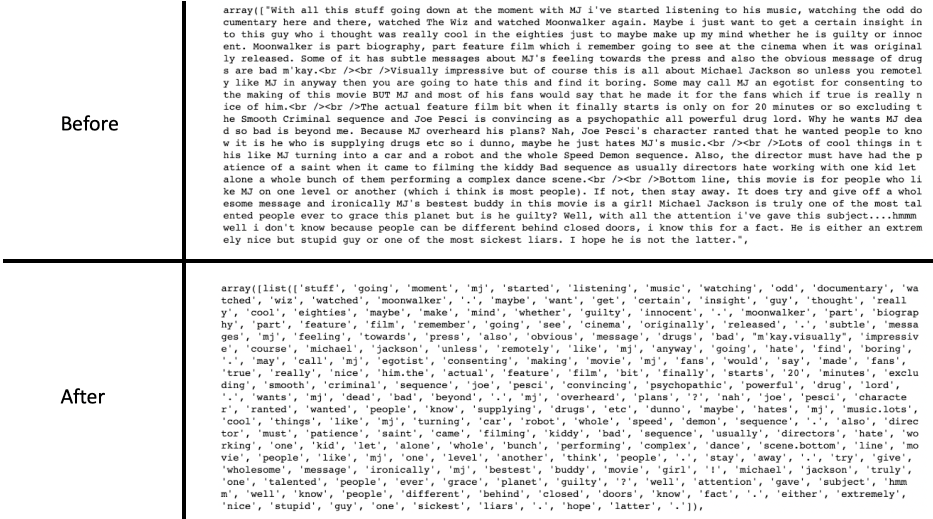

# Data exploration
The dataset consists of 50,000 IMDB movie reviews, specially selected for sentiment analysis and was 
split into:
* labeledTrainData.tsv
* testData.tsv
* unlabeledTrainData.tsv (extra training set with no labels)

All three dataset have the following properties:
* The sentiment of reviews is binary, meaning the IMDB rating < 5 results in a sentiment score of 0, and rating >=7 have a sentiment score of 1. 
* For each movie, there contain multiple reviews with no more than 30 reviews in total.
* labeledTrain and testData contain 25,000 review each with labeled and unlabeled sentiments.

With that in mind, we can first assess the data quality to determine the level of data engineer required 
(e.g., data wrangling, cleansing and preparation).
```bash
import re
import nltk
import sklearn
import numpy             as np
import pandas            as pd
import seaborn           as sns
import matplotlib.pyplot as plt

from pprint              import pprint
from bokeh.io            import output_notebook, show
from bokeh.plotting      import figure
from lib.data_preprocess import Preprocess

# set the output format to jupyter notebook
output_notebook()
nltk.download('stopwords')
nltk.download('punkt')

# define the dataset path
train_path = 'dataset/labeledTrainData.tsv'
test_path  = 'dataset/testData.tsv'

# read in the dataset
pp                = Preprocess()
train_df, test_df = pp.read_file(train_path, test_path, sep='\t')

# check for missing value
print('Training set:')
pp.check_na(train_df)
print()

print('Test set:')
pp.check_na(test_df)

``` 

#### Output:


Nice, both the train and test dataset is complete. However, the datatype of *id* is an object rather than int. 
Due to the lack of information, it is difficult for us to assess the validity of this column.
But since the this column will not affect the model accuracy, we can just check the uniqueness and disregard it for now.

The next tasks is to process the text (i.e., review.) and check the data distribution. 
To clean the reviews, we can take the following steps:
* converting all letters to lower case.
* remove excessive white spaces.
* remove punctuation and weird symbols.
* remove stop words (e.g., a, an, the, this).

```bash
# convert it to lower space
train_df.review = train_df.review.str.lower()

# pattern
sym_removal = lambda review: re.sub(r'(\.{2,})|(\\{1,})|[\(\),¨\":-]' , ' ', review)
tag_removal = lambda review: re.sub(r'<[^>]*>'   , '' , review)
spc_removal = lambda review: re.sub(r'[\s]+'     , ' ', review)
chr_removal = lambda review: re.sub(r'\'[a-z]\s' , ' ', review)

# replace words or substrings which match the pattern
train_df.review = train_df.review.apply(tag_removal)
train_df.review = train_df.review.apply(chr_removal)
train_df.review = train_df.review.apply(sym_removal)
train_df.review = train_df.review.apply(spc_removal)

# plotting wordcloud
stop_words  = set(stopwords.words('english'))
full_review = " ".join(r for r in train_df.review.values.copy())
wordcloud   = WordCloud(stopwords=stop_words, background_color="white").generate(full_review)

plt.figure(figsize=(16,8))
plt.imshow(wordcloud, interpolation='bilinear')
plt.axis("off")
plt.show()

# tokenize and remove stop words
stop_words_removal = lambda string: [w for w in word_tokenize(string) if w not in stop_words]
train_df.review    = train_df.review.apply(stop_words_removal)

```
 ### Output:
Sample output of the processed review.


Most common words in **positive** reviews


Most common words **negative** reviews:

