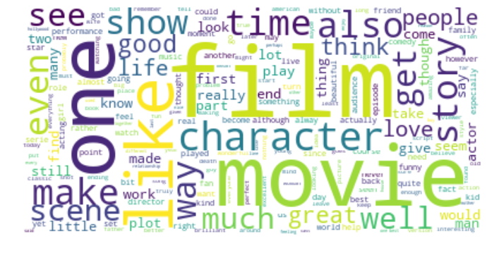

# Data Wrangling
The dataset consists of 50,000 IMDB movie reviews, specially selected for sentiment analysis and was 
split into:
* labeledTrainData.tsv
* testData.tsv
* unlabeledTrainData.tsv (extra training set with no labels)

All three dataset have the following properties:
* The sentiment of reviews is binary, meaning the IMDB rating < 5 results in a sentiment score of 0, and rating >=7 have a sentiment score of 1. 
* For each movie, there contain multiple reviews with no more than 30 reviews in total.
* labeledTrain and testData contain 25,000 review each with labeled and unlabeled sentiments.

With that in mind, we can first assess the data quality to determine the level of data engineer required 
(e.g., data wrangling, cleansing and preparation).
```bash
import re
import nltk
import sklearn
import numpy             as np
import pandas            as pd
import seaborn           as sns
import matplotlib.pyplot as plt

from pprint              import pprint
from bokeh.io            import output_notebook, show
from bokeh.models        import ColumnDataSource
from bokeh.palettes      import Spectral6
from bokeh.plotting      import figure
from lib.data_preprocess import Preprocess
from nltk.corpus         import stopwords 
from nltk.tokenize       import word_tokenize
from nltk.stem           import WordNetLemmatizer
from bs4                 import BeautifulSoup
from PIL                 import Image
from wordcloud           import WordCloud, STOPWORDS, ImageColorGenerator
from tqdm                import tqdm_notebook as tqdm
from scipy               import stats

# plot setting
output_notebook()
sns.set_style('whitegrid')
param = {'figure.figsize': (16, 8),
         'axes.titlesize': 18,
         'axes.labelsize': 16}
plt.rcParams.update(param)

# ntlk setting
nltk.download('stopwords')
nltk.download('wordnet')
nltk.download('punkt')


# define the dataset path
train_path = 'dataset/labeledTrainData.tsv'
test_path  = 'dataset/testData.tsv'

# read in the dataset
pp                = Preprocess()
train_df, test_df = pp.read_file(train_path, test_path, sep='\t')

# check for missing value
print('Training set:')
pp.check_na(train_df)
print()

print('Test set:')
pp.check_na(test_df)

``` 

#### Output:


Nice, both the train and test dataset is complete. However, the datatype of *id* is an object rather than int. 
Due to the lack of information, it is difficult for us to assess the validity of this column.
But since the this column will not affect the model accuracy, we can just check the uniqueness and disregard it for now.

The next tasks is to process the text (i.e., review.) and check the data distribution. 
To clean the reviews, we can take the following steps:
* converting all letters to lower case.
* remove excessive white spaces.
* remove non-words (e.g., punctuation and weird symbols).
* remove html tags.

```bash
# convert it to lower space
def text_process(df):
    # convert it to lower space
    df.review = df.review.str.lower()

    # pattern
    nw_removal  = lambda review: re.sub(r'[^A-Za-z\s]' , ' ', review)
    spc_removal = lambda review: re.sub(r'[\s]+'      , ' ', review)
    tag_removal = lambda review: BeautifulSoup(review, 'lxml').get_text()

    # replace words or substrings which match the pattern
    df.review = df.review.apply(tag_removal)
    df.review = df.review.apply(nw_removal)
    df.review = df.review.apply(spc_removal)
    
    return df


# clean the review
train_df = text_process(train_df)
test_df  = text_process(test_df)

```

#### Output:
Most frequent words in **positive** reviews


Most frequent words in **negative** reviews:


As you can see on the positive and negative word clouds, both of them shared a lot of common words.
Furthermore, the high frequent words (i.e., the big word) appear in the word clouds does not provide significant insight between positive and negative reviews.
Hence, I used TD-IDF vectorizer to find the most frequent and more interesting words (code could be found in [here](https://github.com/jacksenteh/Bag_Of_Popcorns/blob/master/Train.ipynb)).

Most frequent + interesting words in **positive** reviews


Most frequent + interesting words in **negative** reviews:


By comparing two wordclouds, we can see that words such as might and quite appears to be more significant in negative than positive reviews.
Recall that only the rating >= 7 in IMDB will be classified as 1, so these words demonstrate the user might be uncertain about this movie.
Hence, the rating might be around 4~6 which is classified as 0. 
But this is just a speculation based on the current observation, as a data scientist we need to use statistical method to prove this.


Up until now, the high number of features is too high and will leads to the curse of dimensionality. 
Furthermore, it will also slowdown the learning process for a deep learning model (as the model requires more epochs to train and recognize all the words). 
Hence, we can use another text normalization methods to reduce the number of features without losing the meaning/message of the reviews. 
The techniques are:

* **Stemming:** “The process of reducing inflection of words to their root forms such as mapping a group of words into a word stem even if the steam is not a valid word in language. “ 
* **Lemmatization:** “The process of ensuring the root word belongs to the language”. For example, (run, ran, running) -> run.

For more details about the stemming and lemmatization techniques, please visit this [tutorial](https://www.datacamp.com/community/tutorials/stemming-lemmatization-python).
In short, the two techniques above are used for text mining (e.g., extracting high-quality information from text) applications.
The applications include **text categorization, text clustering, concept/entity extraction, production of granular taxonomies, sentiment analysis, document summarization, and entity relation modeling (i.e., learning relations between named entities)**.
 
In this project, we will use the lemmatization techniques to get the root word in proper english language.

```bash
def lemmatize(review):
    lemmatization = WordNetLemmatizer()
    stop_words    = set(stopwords.words('english'))
    
    # tokenize, lemmatize and stop words removal
    tokens            = word_tokenize(review)
    lemmatized_tokens = list(map(lambda x: lemmatization.lemmatize(x, pos='v'), tokens))
    meaningful_tokens = list(filter(lambda x: not x in stop_words, lemmatized_tokens))
    
    return meaningful_tokens
    
train_df['review_tokenized'] = list(map(lemmatize, train_df.review.values.copy()))
test_df['review_tokenized']  = list(map(lemmatize, test_df.review.values.copy()))

```

#### Output


From the distribution plot above, we can see each review tends to have 50 to 100 words.
The nex